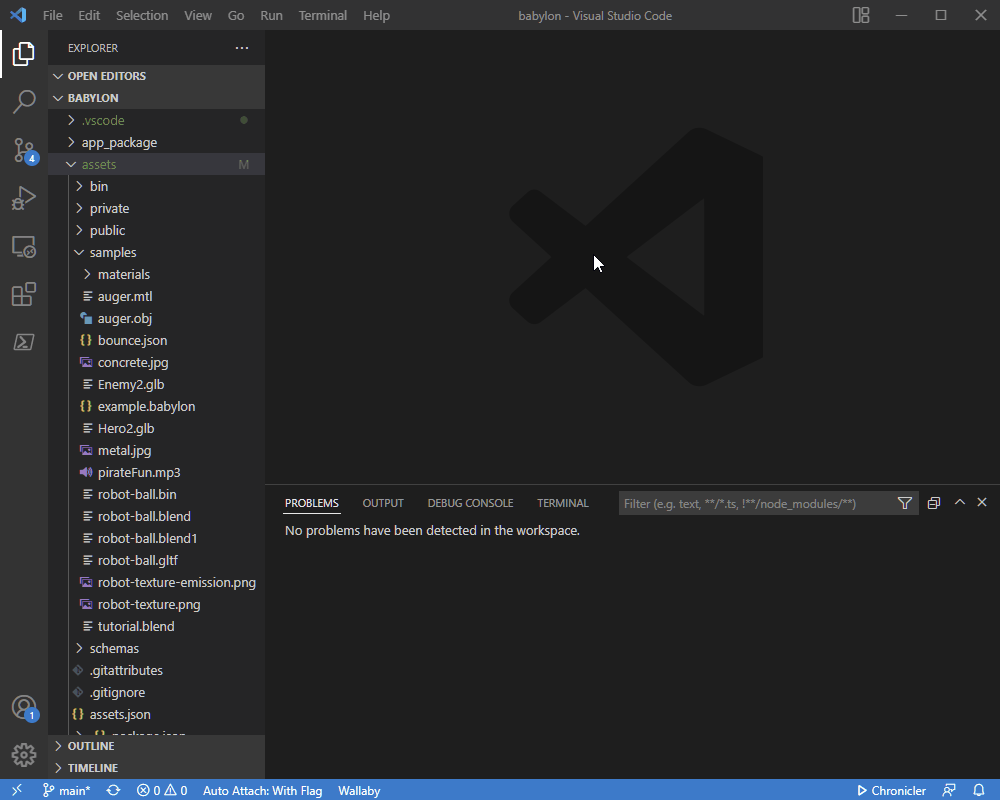
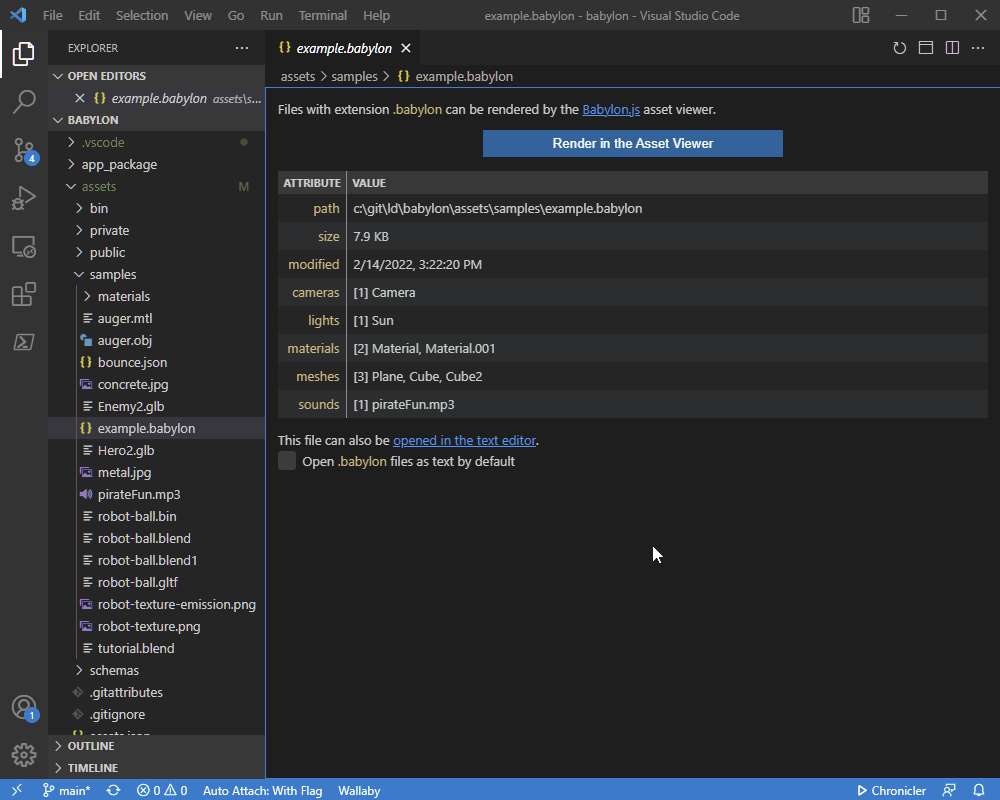

# babylonjs-viewer README

This is a viewer for several of the asset file types used for game development with the
[Babylon.js](https://babylonjs.com) engine. Typically such files are formatted for parsing by
software rather than humans, so opening them in VS Code isn't very helpful.

With this extension, opening one of these files presents a digest that summarizes the file content
and metadata. With a button click, the asset renders in a dedicated viewer panel powered by the
Babylon.js engine. The viewer supports the same functionality as the
[Babylon.js Sandbox](https://sandbox.babylonjs.com), including full
[Inspector](https://doc.babylonjs.com/toolsAndResources/tools/inspector) support.

## Features

* Support for multiple asset file types: `.babylon`, `.gltf`, `.glb`, and `.obj`.
* Rendering support via the Babylon.js engine.

  

* Filetype-specific digest summaries of asset file contents.
* Full JSON schema for `.babylon` files (used for syntax highlighting and intellisense in text-edit
  mode).

  

## Requirements

None.

## Extension Settings

No custom settings. However, by default this extension opens asset files in a digest summary view
instead of the text editor. This can be changed on a per-file-extension basis through any of:
* Checking the `Open <extension> files as text by default` box on the digest summary.
* Right-clicking on an asset file and selecting `Open With...`
* Modifying `workbench.editorAssociations`

## Known Issues

* The contents of the summary digests are a work in progress. Suggestions and requests are welcome
  on the project [Issues Page](https://github.com/bmcbarron/vscode-babylonjs-viewer/issues).
* The file analysis to produce summary digests is re-executed every time a file is opened. In the
  future, an LRU cache will prevent re-processing of recently accessed files.
* Changes to a file do not automatically update any opened digest or viewer windows for that file.

## [Release Notes](CHANGELOG.md)
